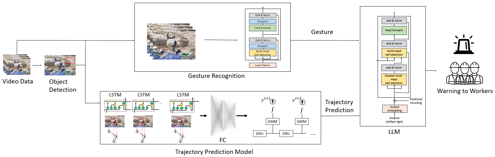

# 캡스톤 프로젝트
## 프로젝트 

이 프로젝트는 제조 현장에서 발생할 수 있는 사고를 예방하기 위한 시스템입니다. 
카메라를 이용해 받은 이미지에서 위험한 지역을 설정한 후, 실무자의 경로를 예측하여 위험 지역으로 이동하는 것으로 판단되면 LLM을 활용하여 TTS로 위험을 알려줍니다. 
또한, 실무자의 현재 상태를 확인하여 응급 상황으로 판단되면 자동으로 신고할 수 있도록 설계되었습니다.


## 아나콘다 가상 환경 설정

1. `capstone.yaml` 파일을 사용하여 가상환경을 생성합니다:
   ```bash
   conda env create --file capstone.yaml
   ```

2. 가상환경을 활성화합니다:
   ```bash
   conda activate koo1
   ```

## 전체 과정 실행

1. `api_key` 부분에 LLM을 실행하기 위한 API 키를 입력합니다.
2. 아래 명령어를 실행하여 전체 과정을 실행합니다:
   ```bash
   python main.py
   ```

## 경로 예측 실행

### 비디오 데이터를 이용한 실행

1. `trajectory_predict.py` 파일에서 `video_path` 변수에 원하는 비디오 데이터 경로를 입력합니다.
   ```python
   video_path = 'C:\Users\kooo\Documents\VIRAT_S_010204_05_000856_000890.mp4'
   cap = cv2.VideoCapture(video_path)
   ```

2. 아래 명령어를 실행합니다:
   ```bash
   python trajectory_predict.py
   ```

### 카메라를 이용한 실행

1. `trajectory_predict.py` 파일에서 `cap` 변수를 아래와 같이 수정합니다:
   ```python
   cap = cv2.VideoCapture(0)
   ```

2. 아래 명령어를 실행합니다:
   ```bash
   python trajectory_predict.py
   ```


